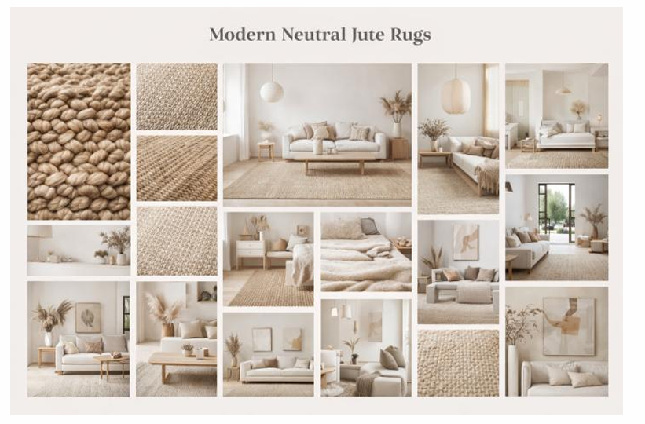

# Wayfair Rugs Market Intelligence: AI Agent Demo

**Author:** Hayah Ahmed
---

## Executive Summary

### Objective

To enable Wayfair's Rugs category team to move from manual, reactive analysis to automated, continuous market intelligence by extracting trends, competitor signals, and actionable insights directly from live retail data.

### Solution

Built multiple interconnected AI agents orchestrated through **n8n**, forming a single Market Intelligence system that ingests raw product data, processes it, applies AI reasoning, and delivers insights via a unified dashboard.

### Core Outputs

- **Trend Discovery Agent** – Extracts emerging materials, styles, and price patterns from Wayfair listings
- **Competitor Monitoring Agent** – Scrapes and analyzes Amazon rug listings for pricing and assortment shifts
- **AI Insights Agent** – Converts structured signals into executive-level summaries and insights
- **Moodboard Agent** – Consolidates outputs into a single, interpretable view

### Key Insights

- Growing emphasis on functional rugs (washable, indoor–outdoor) alongside design
- Increased presence of natural and sustainable materials across mid-range price points
- Shift toward simplified geometric and neutral aesthetics in competitive assortments

### Future Improvements

Integrating internal Wayfair performance metrics would allow validation of market signals against actual conversion and sales behavior.

---

## Agent 1: Moodboard Generator

*From Design Prompt → AI-Curated Visual Mood*

### Objective

To translate abstract trend or design prompts into visual moodboards that support early-stage design alignment and creative exploration for the Rugs category.

### Input Prompt Example

```
"Neutral jute rugs, modern"
```

### Input Notes

- Prompts should be short and descriptive, focusing on style, material, and tone
- Combining material + aesthetic yields more coherent visuals
- Subjective language is avoided to ensure consistent generation

### Free-Tier Limitation

Image generation is limited to **20 outputs per day** under the free Google Gemini tier.

### Output

`wayfair_moodboard.txt`



---

## Agent 2: Wayfair Trend Discovery Agent

*From Multi-Source Market Data → Structured Trend Intelligence*

### Objective

The agent first identifies user intent:
- **Informational question** (e.g., rug care) → simple LLM response
- **Trend or market analysis** (comparisons, demand signals) → RSS feeds + web scraping + AI analysis to surface market insights

### Supported Prompt Types

- Natural-language questions
- Product URLs
- Collection URLs

### Sample Inputs

```
"How do I clean a rug?"
→ Informational → LLM only

"Compare this rug https://www.amazon.com/dp/B0C7QZ5R9X
 with best-selling rugs https://www.amazon.com/s?k=best+selling+rugs"
→ Trend query → Full pipeline
```

### Input Notes

- Intent is checked before scraping
- Collection pages = market demand analysis

### Improvements / Expansion Opportunities

- Add intent confidence scoring
- Support mixed insight responses
- Include Wayfair internal search data
- Track repeated customer questions

### Outputs

`Wayfair Trend Analysis.txt` | `wayfair.pdf`

---

## Agent 3: AI Insights & Content Agent

*From raw trend & competitor data to campaign-ready storytelling*

### Objective

The AI Insights & Content Agent translates trend signals and competitor insights into creative, brand-aligned marketing content for Wayfair. Its goal is not just to summarize data, but to think like a marketer — turning insights into blog strategies, campaign hooks, and social content that can directly support Wayfair's merchandising and marketing teams.

### Input Prompt Example

The agent is prompted with real-world competitor and trend data sourced from product and collection pages. For example, it receives an Amazon product URL and a related collection URL (such as Bohemian rugs) and is asked to generate marketing content ideas including blog concepts, headlines, and social captions grounded in observed market signals.

### Input Notes

- When trend, competitor, or style signals are missing, the agent uses clearly stated assumptions based on common home-decor market patterns and consumer behavior
- All assumptions are explicitly documented to maintain transparency and prevent misleading or unsupported insights

### Improvements / Expansion Opportunities

- Integrate live trend APIs and Wayfair internal performance data to minimize reliance on assumed signals
- Expand output with stronger brand-voice controls, multi-channel content formats, and feedback loops driven by campaign performance

### Outputs

`Wayfair_ContentAgent.txt` | `wayfaircontent.pdf`

---

## Reflections & Future Improvements

### Key Learnings

- Learned how AI can translate raw trend and competitor signals into actionable, campaign-ready content for marketing teams
- Understood how market data can inform storytelling decisions such as positioning, messaging angles, and content formats
- Gained hands-on experience refining AI agents to think beyond analysis and produce creative, brand-aligned outputs

### Future Improvements / Next Steps

- Integrate live trend APIs and internal performance data to reduce reliance on assumed signals and improve accuracy
- Strengthen brand-voice controls so the generated content aligns more closely with Wayfair's tone across channels
- Expand outputs to include multi-channel content such as email campaigns, PDP copy, and paid media concepts
